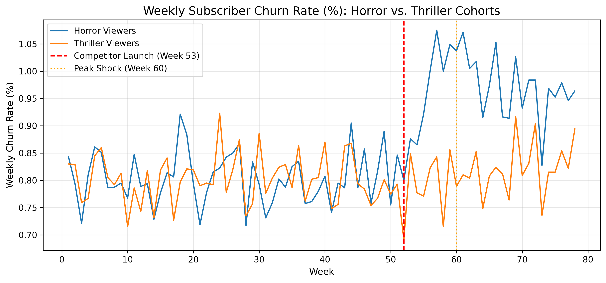
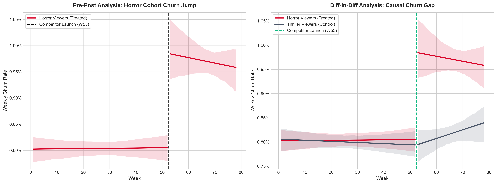
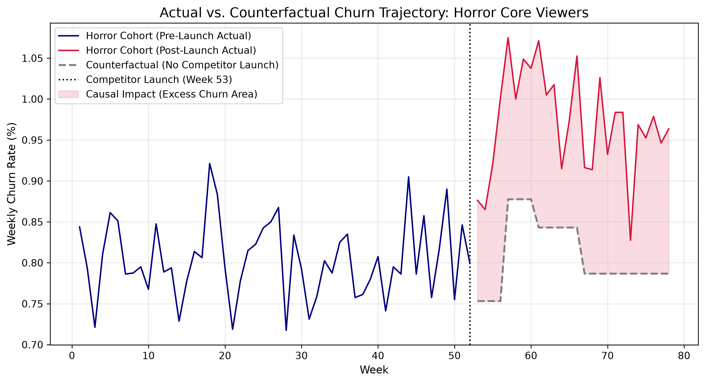

## Project Summary

A niche horror-only streaming competitor launches into the market. Primeflix wants to know: did this hurt us, and if so, who did it hurt?

Customers are split by genre-viewing behavior - Horror viewers (70%+ of watch time in horror) are the treated group, and Thriller viewers (70%+ of watch time in thriller) are the control group. Thriller viewers were chosen as the control because they show similar pre-launch engagement patterns to horror viewers but aren't served by a horror-only competitor, making them a credible counterfactual. This project uses Difference-in-Differences to estimate the causal impact of the competitor's launch on horror-viewer churn.

**Campaign Timeline**

| Period | Phase |
|---|---|
| Months 1-12 | Pre Launch Baseline behavior |
| Month 13 | Competitor Launch |
| Months 13-18 | Post Launch Measurement |

**Analysis Priorities**

1. **Parallel trends validation** - do Horror and Thriller viewers show statistically similar churn trends before the competitor launches? This is the credibility check that has to pass before any causal claim is made.
2. **Causal impact estimate** - using DiD, how much incremental churn did the competitor launch cause among Horror viewers, relative to Thriller viewers over the same period?
3. **Robustness checks** - does the effect hold up when the treatment/control threshold is redefined at 50%, 60%, and 70% horror/thriller viewing share, rather than relying on one arbitrary cutoff?

The genre segmentation is central to this analysis because a company can't just compare "affected" and "unaffected" customers without a pre-existing relationship between them - bundling all non-horror viewers together would violate the parallel trends assumption and produce an estimate that isn't defensible. I don't mind if the data is a little unrealistic; the focus is on demonstrating a rigorous causal inference workflow (problem framing, control group justification, pre-trend validation, estimation, and robustness) over data realism.

## Key Findings
In Week 53, a rival streaming platform launched a dedicated niche service directly targeting horror content viewers. Using Difference-in-Differences (DiD) econometric modeling with Weighted Least Squares (WLS) and HC1 robust standard errors, this evaluation measures the causal impact of that launch on subscriber churn.

By comparing Horror core viewers (Treated Group) against Thriller core viewers (Control Group), we isolate the true competitive effect from overall platform trend shifts.

### Dynamic Difference-in-Differences (WLS Regression)
* **Model Fit**: $R^2 = 0.638$, Adjusted $R^2 = 0.616$, $F(9, 146) = 45.57$ ($p = 4.44 \times 10^{-38}$)
* **Baseline Pre-Launch Churn**: **0.80%** per week across both cohorts ($p < 0.001$)
* **Pre-Period Parallel Trends**: The coefficient for `treated` prior to Week 53 is statistically indistinguishable from zero ($p = 0.674$), confirming that Horror and Thriller cohorts behaved identically prior to competitor entry

### What the Results Mean

Initial Trial Phase (Weeks 53–56):
    Causal Effect: $+0.110\%$ percentage point increase in churn ($p = 0.002$)
    Interpretation: Immediately upon launch, user curiosity caused an initial bump in cancellations as subscribers tested the rival platform
Peak Shock Phase (Weeks 57–60):
    Causal Effect: $+0.236\%$ percentage point increase in churn ($p < 0.001$)
    Interpretation: Churn peaked 4–7 weeks post-launch, driving weekly Horror churn from a baseline of ~0.80% up to ~1.04%. This represents the maximum competitive impact.
Early Decay & Settled Tail (Weeks 61–78):
    Causal Effect: Decay to $+0.190\%$ (W61–66) and stabilization at $+0.114\%$ (W67–78) ($p < 0.001$)
    Interpretation: Churn did not return to the pre-launch baseline, but it decayed significantly from its peak.

Peak vs. Tail Hypothesis Test
    -   Peak Impact: $+0.236\%$ points
    -   Long-Term Impact: $+0.114\%$ points
    -   Decay Difference: $-0.121\%$ points ($Z = 2.9946$, $p = 0.0027$)
    -   Takeaway: The drop from peak shock to settled tail is statistically significant ($p < 0.05$). The competitor launch created an immediate acquisition shock that naturally tapered into a lower, stable long-term equilibrium.
    
### Analytical Visualizations
1. Weekly Raw Churn Rates Over Time
   
     - Highlighting the exact moment of launch (Week 53 red line) and peak shock window (Week 60 orange line), illustrating the dynamic rise and partial recovery of the Horror cohort relative to Thriller
       

2. Pre-Post vs. Diff-in-Diff Discontinuity Analysis
   
    - Left Panel: Simple pre-post jump showing a clear shift upwards in Horror churn post-Week 53
    - Right Panel: Diff-in-Diff view showing the control group (Grey) remaining flat at ~0.80%, confirming that the rise in Horror churn (Red) was caused by the competitor, not general platform noise
      

3. Actual vs. Counterfactual Churn Trajectory
   
    - Blue Line: Actual pre-launch baseline (~0.80%)
    - Red Line: Actual post-launch churn rate for Horror viewers
    - Dashed Grey Line: Estimated counterfactual trajectory (what Horror churn would have been without the competitor launch, tracked via the Thriller control group)
    - Shaded Area: The accumulated Excess Churn caused directly by the launch
      

## Data Design Decisions

-   Total Primeflix subscriber base (implied): ~1,000,000
-   Horror viewers (treated group, 70%+ horror watch share): 80,000
-   Thriller viewers (control group, 70%+ thriller watch share): 100,000
-   Rationale: Horror and Thriller are treated as niche-concentration segments within a much larger, genre-mixed base - most subscribers don't concentrate 70%+ in a single genre. Thriller is sized larger than Horror to reflect its more mainstream appeal

### Baseline churn rate
-   ~3–4% monthly churn, converted to weekly probability (Acquisition can be assumed to offset baseline churn at the topline business level)

## Timeline

78-week panel (18 months)
-   Weeks 1–52: pre-launch baseline
-   Week 53: competitor launches
-   Weeks 53–78: post-launch measurement window
